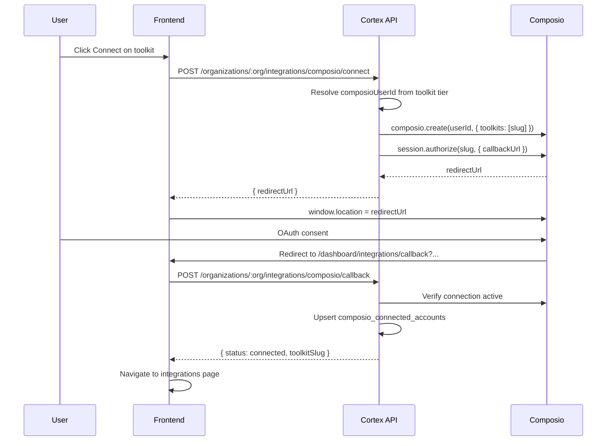

# 07 — Authentication Flows

## Overview

Composio replaces all BYOC SaaS credential flows. Auth uses **Composio managed auth** + **Connect Links**.

No custom OAuth app credentials in v1.

## Composio User ID Mapping

| Connection tier | Composio `user_id` | Who connects |
|-----------------|-------------------|--------------|
| ORG_SHARED | `org:{organizationUuid}` | User with `org:integrations:manage` |
| USER_PERSONAL | `user:{userUuid}` | Any org member |

Fixed toolkit → tier mapping seeded on sync (see `02-gap-analysis.md`).

## Flow 1: Manual Connect (Integrations Dashboard)

Primary flow for `/dashboard/integrations`.



### API: Initiate connect
```
POST /organizations/:organization_uuid/integrations/composio/connect
Body: { toolkit_slug: string }
Permission: org:integrations:manage (org-shared) OR authenticated member (user-personal)
Response: { redirect_url: string, connection_request_id?: string }
```

### API: Callback verification
```
POST /organizations/:organization_uuid/integrations/composio/callback
Body: { toolkit_slug: string, connection_request_id?: string }
Response: { status: 'connected' | 'pending' | 'failed', connected_account_id?: string }
```

### Frontend callback route
```
/dashboard/integrations/callback
```
- Read query params from Composio redirect
- Call backend callback endpoint
- Show success/error toast
- Redirect to `/dashboard/integrations` or toolkit detail

## Flow 2: In-Chat Authentication

When agent needs unconnected toolkit, meta tool `COMPOSIO_MANAGE_CONNECTIONS` returns Connect Link.

Agent runner config:
```typescript
const session = await composio.create(composioUserId, {
  toolkits: enabledToolkits,
  manageConnections: true,  // enables in-chat auth
});
```

User sees link in chat → completes OAuth → agent retries.

No separate Cortex callback required for in-chat flow — Composio handles redirect back to chat context.

## Flow 3: Reconnect

Expired/revoked connection:
```
POST /organizations/:org/integrations/composio/reconnect
Body: { connected_account_id: string }
```
Same as connect — new `session.authorize()` call.

## Flow 4: Disconnect

```
DELETE /organizations/:org/integrations/composio/accounts/:connected_account_id
```
Calls `composio.connectedAccounts.delete(id)` + local mirror delete.

## Flow 5: Org Toolkit Enablement

Before users can connect, org must enable toolkit (if required by product rules):

```
POST /organizations/:org/integrations/composio/toolkits/:slug/enable
Permission: org:integrations:manage
```

Creates `org_enabled_toolkits` row. Only platform-enabled (`composio_toolkits.is_enabled`) toolkits can be org-enabled.

## Cortex App Auth (unchanged)

1. Email login → user JWT
2. Switch organization → org JWT with permissions
3. All Composio routes require org JWT + `OrganizationMatchGuard`

## Token Storage

**Never store OAuth tokens in Cortex DB.** Composio connected accounts hold credentials. Local `composio_connected_accounts` stores only:
- `composio_account_id`
- status metadata
- display label

## Security Checklist

- [ ] `callbackUrl` must be allowlisted origin (frontend URL from env `APP_URL`)
- [ ] Validate user can connect for tier (org-shared requires manage permission)
- [ ] Rate limit connect endpoints (5/min per user)
- [ ] Audit log: `integration.connected`, `integration.disconnected`

## Removed Flows

- Manual API key paste forms for SaaS providers
- Google OAuth Playground instructions
- `POST /integrations` with encrypted config blob for SaaS
- SMTP/Resend/SendGrid test endpoints (use Composio toolkits)
