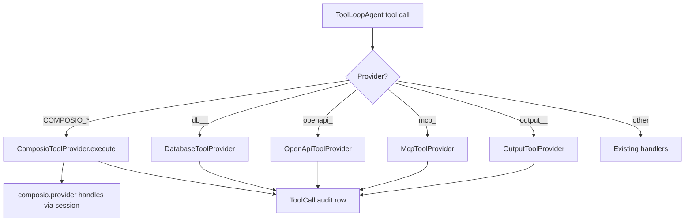

# 08 — Tool Execution Layer

## Unified Tool Registry

Replace `IntegrationRegistry` as the single discovery and execution entry point.

```typescript
@Injectable()
export class UnifiedToolRegistry {
  constructor(
    private readonly providers: ToolProvider[],
  ) {}

  async discover(ctx: ToolDiscoveryContext): Promise<UnifiedTool[]> {
    const results = await Promise.all(
      this.providers.map((p) => p.discover(ctx)),
    );
    return results.flat();
  }

  async execute(ctx: ToolExecutionContext): Promise<unknown> {
    const provider = this.resolveProvider(ctx.toolName);
    return provider.execute(ctx);
  }
}
```

### Provider registration order
1. `ComposioToolProvider` — meta tools from session
2. `DatabaseToolProvider` — wraps existing `DatabaseIntegration`
3. `OpenApiToolProvider` — wraps existing OpenAPI integration
4. `McpToolProvider` — wraps user MCP servers
5. `OutputToolProvider` — PDF/Excel/Word/table/widget
6. `DocumentToolProvider` — document read tools
7. `OrganizationToolProvider` — org profile tools
8. `SandboxToolProvider` — code_interpreter

## Tool Discovery Context

```typescript
interface ToolDiscoveryContext {
  organizationUuid: string;
  userUuid: string;
  userPermissions: string[];
  integrationUuids?: string[];      // legacy DB/OpenAPI/MCP scope
  enabledToolkitSlugs?: string[];   // Composio scope
  composioSession: ToolRouterSession;
}
```

## Composio Meta Tools in Agent

`ComposioToolProvider.discover()`:
```typescript
async discover(ctx: ToolDiscoveryContext): Promise<UnifiedTool[]> {
  const sessionTools = await ctx.composioSession.tools();
  const allowedSlugs = await this.getAllowedToolSlugs(ctx.organizationUuid);

  return sessionTools
    .filter((t) => this.isAllowed(t, allowedSlugs))
    .map((t) => this.toUnifiedTool(t));
}
```

Meta tools are **not** individually listed in `org_tool_permissions` — permissions apply to underlying toolkit enablement. Optionally gate `COMPOSIO_MULTI_EXECUTE_TOOL` with `integrations:tools:execute`.

## Legacy Tool Providers

### Database
- Tool prefix: `db__`
- Unchanged execution path via `DatabaseIntegration`
- Gated by `integration_actions.enabled`

### OpenAPI
- Tool prefix: `openapi_{uuid8}__`
- Unchanged

### MCP
- Tool prefix: `mcp_{uuid8}__`
- Unchanged — user MCP servers, not Composio MCP URL

## Tool Naming (Composio)

Composio meta tools keep Composio names:
- `COMPOSIO_SEARCH_TOOLS`
- `COMPOSIO_MULTI_EXECUTE_TOOL`
- etc.

Logged in `tool_calls.composio_tool_slug` when applicable.

## Execution Path



## ToolDispatcherService Changes

```typescript
async dispatch(...) {
  const providerType = this.resolveProviderType(toolName);
  await this.assertAllowed(toolName, providerType, orgUuid, userPermissions);

  if (providerType === 'COMPOSIO') {
    return this.registry.execute({ ...ctx, composioSession });
  }
  return this.registry.execute(ctx);
}
```

### Permission checks
| Provider | Check |
|----------|-------|
| COMPOSIO | Org has toolkit enabled + user has connect for tier + `integrations:tools:execute` |
| DATABASE/OPENAPI/MCP | Existing `integration_actions` + optional `required_permission_key` |
| OUTPUT/DOCUMENT | Existing rules |
| ORGANIZATION | Existing permission keys |

## Human-in-the-Loop

`needsApproval` on Composio tools:
- Map from `org_tool_permissions.requires_approval` for toolkit's destructive tools
- Meta tool `COMPOSIO_MULTI_EXECUTE_TOOL` approval when any nested tool requires approval (conservative default: false for search, true for execute if configured)

Store pending approval in `agent_executions.status = AWAITING_APPROVAL` — existing flow.

## Idempotency

Keep `ExecutionToolIdempotencyService` — cache key includes `toolName + input hash`.

Composio executions included.

## Conversation Tool Selection (refactor)

**Before:** `integrationUuids: string[]` on message
**After:** 
```typescript
{
  integrationUuids?: string[];     // DB/OpenAPI/MCP only
  toolkitSlugs?: string[];       // Composio toolkits to scope session
}
```

If `toolkitSlugs` omitted, use all org-enabled toolkits with active connections.

## Response Normalization

All providers return JSON-serializable result. `ToolDispatcherService` applies `toJsonValue()`.

Composio responses passed through as-is unless modifier hooks added later.

## Limits

| Limit | Value |
|-------|-------|
| OpenAPI tools per spec | 100 (unchanged) |
| MCP tools per server | 100 (unchanged) |
| Composio toolkits per session | 50 (configurable) |
| Composio meta tool loop steps | existing agent max steps |

## Files to Modify

| File | Change |
|------|--------|
| `integration-tools.factory.ts` | Use UnifiedToolRegistry + ComposioSessionService |
| `tool-dispatcher.service.ts` | Provider type routing |
| `agent-runner.service.ts` | Resolve/create Composio session before tool build |
| `messages.service.ts` | Accept `toolkitSlugs` in DTO |
| `integration-registry.service.ts` | Deprecate → delegate to UnifiedToolRegistry |
